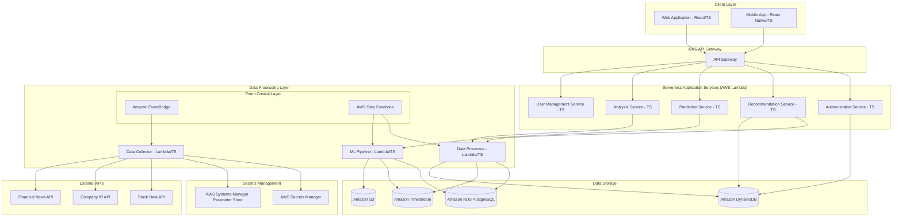

# Design Document

## Overview

The Intelligent Stock Recommendation System is a comprehensive platform that provides data-driven stock recommendations, future price projections, and evidence-based investment rationale for individual investors. The system differentiates itself from traditional market reports by offering actionable guidance including specific entry points, price appreciation forecasts, and optimal selling timing.

### Key Design Principles

1. **Serverless-First Architecture**: Minimize operational overhead with AWS Lambda and managed services
2. **TypeScript Monorepo**: Unified codebase with shared types and utilities across all services
3. **Event-Driven Processing**: Use EventBridge and Step Functions for decoupled, scalable data processing
4. **Data-Driven Decision Making**: All recommendations are based on proprietary algorithms analyzing multiple data sources
5. **Evidence-Based Rationale**: Every recommendation is supported by historical similar cases and company IR information
6. **Real-Time Validation**: Continuous tracking of predictions against actual market performance
7. **Personalization**: Tailored recommendations based on individual investor profiles and risk tolerance
8. **Cost-Optimized Scalability**: Accept cold start latency in favor of reduced maintenance costs
9. **Security by Design**: Centralized secrets management and least-privilege access patterns

## Architecture

### High-Level Architecture



### Technology Stack (Serverless & TypeScript-First)

- **Monorepo Structure**: TypeScript-based monorepo with shared libraries
- **Backend**: AWS Lambda functions with TypeScript and Node.js runtime
- **API Layer**: AWS API Gateway with Lambda proxy integration
- **Database**: Amazon RDS (PostgreSQL) for relational data, Amazon Timestream for time series data
- **NoSQL**: Amazon DynamoDB for user sessions and fast lookups
- **Storage**: Amazon S3 for file storage and ML model artifacts
- **Machine Learning**: AWS SageMaker with TypeScript SDK, TensorFlow.js for client-side inference
- **Event Processing**: Amazon EventBridge for event routing, AWS Step Functions for workflow orchestration
- **Secrets Management**: AWS Secrets Manager for API keys, AWS Systems Manager Parameter Store for configuration
- **Frontend**: React.js with TypeScript, deployed on AWS CloudFront + S3
- **Mobile**: React Native with TypeScript for cross-platform mobile apps
- **Infrastructure**: AWS CDK with TypeScript for Infrastructure as Code
- **Monitoring**: AWS CloudWatch, AWS X-Ray for distributed tracing

## Components and Interfaces

### 1. Data Collection Service (AWS Lambda + EventBridge)

**Purpose**: Automatically collect and update stock prices, company IR information, and market data using event-driven architecture

**Key Components**:
- Stock Price Collector: Lambda function triggered by EventBridge schedule
- IR Information Collector: Lambda function for company investor relations data
- Market Data Collector: Lambda function for market trends and economic indicators
- News Collector: Lambda function for financial news and sentiment analysis
- Event Control Layer: EventBridge rules and Step Functions for orchestration
- Secrets Integration: AWS Secrets Manager for API credentials

**Interfaces**:
```typescript
interface DataCollectorService {
  collectStockData(symbols: string[]): Promise<StockDataResponse>;
  collectIRData(companyId: string): Promise<IRDataResponse>;
  collectMarketData(dateRange: DateRange): Promise<MarketDataResponse>;
  scheduleDataCollection(frequency: string): Promise<void>;
}

interface SecretsManagerService {
  getApiCredentials(apiName: string): Promise<ApiCredentials>;
  rotateCredentials(apiName: string): Promise<void>;
}

interface EventBridgeService {
  publishDataCollectionEvent(event: DataCollectionEvent): Promise<void>;
  scheduleRecurringCollection(schedule: ScheduleExpression): Promise<void>;
}
```

### 2. Recommendation Engine (AWS Lambda + SageMaker)

**Purpose**: Generate personalized stock recommendations using proprietary algorithms in a serverless environment

**Key Components**:
- Algorithm Engine: Lambda function with core recommendation logic
- Personalization Module: Lambda function for user preference integration
- Risk Assessment: Lambda function for risk tolerance evaluation
- Entry Point Calculator: Lambda function for optimal buy signal determination
- ML Model Integration: SageMaker endpoints for complex predictions

**Interfaces**:
```typescript
interface RecommendationEngineService {
  generateRecommendations(userProfile: UserProfile): Promise<StockRecommendation[]>;
  calculateEntryPoints(stockSymbol: string): Promise<EntryPointData>;
  assessRiskLevel(stockSymbol: string, userProfile: UserProfile): Promise<RiskLevel>;
  personalizeRecommendations(
    recommendations: StockRecommendation[], 
    userProfile: UserProfile
  ): Promise<StockRecommendation[]>;
}

interface SageMakerService {
  invokeRecommendationModel(input: ModelInput): Promise<ModelOutput>;
  deployModel(modelArtifacts: string): Promise<EndpointConfig>;
}
```

### 3. Price Prediction Service (AWS Lambda + SageMaker + Step Functions)

**Purpose**: Forecast future price movements with multiple scenario modeling using serverless ML pipeline

**Key Components**:
- Predictive Models: SageMaker endpoints for price forecasting models
- Scenario Generator: Lambda function for best/worst/expected case modeling
- Timeline Calculator: Lambda function for time-based milestone establishment
- Selling Point Optimizer: Lambda function for optimal exit timing calculation
- ML Pipeline Orchestration: Step Functions for complex prediction workflows

**Interfaces**:
```typescript
interface PricePredictionService {
  predictPriceTrajectory(stockSymbol: string, timeHorizon: number): Promise<PricePrediction>;
  generateScenarios(stockSymbol: string): Promise<ScenarioModeling>;
  calculateSellingPoints(stockSymbol: string, entryPrice: number): Promise<SellingPoints>;
  establishMilestones(prediction: PricePrediction): Promise<Milestone[]>;
}

interface StepFunctionsService {
  executePredictionWorkflow(input: PredictionWorkflowInput): Promise<WorkflowExecution>;
  monitorWorkflowExecution(executionArn: string): Promise<ExecutionStatus>;
}
```

### 4. Analysis and Rationale Service (AWS Lambda + DynamoDB)

**Purpose**: Provide evidence-based investment rationale using IR data and historical cases with fast serverless processing

**Key Components**:
- IR Analyzer: Lambda function for company investor relations information analysis
- Historical Pattern Matcher: Lambda function with DynamoDB for similar case identification
- Correlation Engine: Lambda function for price movement and fundamental correlation
- Evidence Compiler: Lambda function for rationale documentation generation
- Fast Data Access: DynamoDB for quick historical case lookups

**Interfaces**:
```typescript
interface AnalysisService {
  analyzeIRData(companyId: string): Promise<IRAnalysis>;
  findSimilarCases(stockPattern: StockPattern): Promise<HistoricalCase[]>;
  correlateFundamentalsPrice(stockSymbol: string): Promise<CorrelationAnalysis>;
  compileInvestmentRationale(stockSymbol: string): Promise<InvestmentRationale>;
}

interface DynamoDBService {
  queryHistoricalCases(pattern: PatternQuery): Promise<HistoricalCase[]>;
  putAnalysisResult(result: AnalysisResult): Promise<void>;
  getAnalysisCache(key: string): Promise<AnalysisResult | null>;
}
```

### 5. Performance Tracking Service (AWS Lambda + Timestream + EventBridge)

**Purpose**: Monitor prediction accuracy and validate system effectiveness through real trading results using time-series optimized storage

**Key Components**:
- Prediction Tracker: Lambda function for continuous monitoring with EventBridge triggers
- Performance Calculator: Lambda function for success rate and return calculation
- Validation Engine: Lambda function for real trading result validation
- Reporting Generator: Lambda function for performance report creation
- Time Series Storage: Amazon Timestream for efficient time-based data queries

**Interfaces**:
```typescript
interface PerformanceTrackingService {
  trackPredictions(predictionId: string): Promise<TrackingStatus>;
  calculatePerformanceMetrics(timePeriod: DateRange): Promise<PerformanceMetrics>;
  validateTradingResults(tradeData: TradeData): Promise<ValidationResult>;
  generatePerformanceReport(userId: string): Promise<PerformanceReport>;
}

interface TimestreamService {
  writePerformanceData(data: PerformanceDataPoint[]): Promise<void>;
  queryPerformanceHistory(query: TimestreamQuery): Promise<PerformanceDataPoint[]>;
  aggregatePerformanceMetrics(timeRange: DateRange): Promise<AggregatedMetrics>;
}
```

## Data Models

### Core Data Models (TypeScript)

```typescript
// Shared types across the monorepo
export interface StockRecommendation {
  symbol: string;
  companyName: string;
  entryPrice: number;
  targetPrice: number;
  confidenceScore: number;
  riskLevel: RiskLevel;
  investmentRationale: string;
  similarCases: HistoricalCase[];
  createdAt: Date;
}

export interface PricePrediction {
  stockSymbol: string;
  currentPrice: number;
  predictedPrices: Record<number, number>; // days -> price
  scenarios: ScenarioModeling;
  milestones: Milestone[];
  confidenceInterval: [number, number];
  createdAt: Date;
}

export interface UserProfile {
  userId: string;
  riskTolerance: RiskLevel;
  investmentPeriod: number; // months
  investmentAmount: number;
  experienceLevel: ExperienceLevel;
  preferences: Record<string, unknown>;
  createdAt: Date;
  updatedAt: Date;
}

export interface HistoricalCase {
  caseId: string;
  companyName: string;
  symbol: string;
  patternType: string;
  priceAppreciation: number;
  timePeriod: number;
  irFactors: string[];
  similarityScore: number;
}

export interface InvestmentRationale {
  stockSymbol: string;
  irAnalysis: IRAnalysis;
  fundamentalFactors: string[];
  technicalFactors: string[];
  similarCases: HistoricalCase[];
  riskFactors: string[];
  confidenceLevel: number;
}

// Enums and utility types
export enum RiskLevel {
  LOW = 'LOW',
  MEDIUM = 'MEDIUM',
  HIGH = 'HIGH'
}

export enum ExperienceLevel {
  BEGINNER = 'BEGINNER',
  INTERMEDIATE = 'INTERMEDIATE',
  ADVANCED = 'ADVANCED'
}

// AWS Lambda event types
export interface LambdaEvent<T = unknown> {
  body: T;
  headers: Record<string, string>;
  requestContext: {
    requestId: string;
    stage: string;
  };
}

export interface LambdaResponse<T = unknown> {
  statusCode: number;
  headers?: Record<string, string>;
  body: string; // JSON stringified T
}
```

### Database Schema (Multi-Database Approach)

#### Amazon RDS (PostgreSQL) - Relational Data
```sql
-- Users table
CREATE TABLE users (
    id UUID PRIMARY KEY,
    email VARCHAR(255) UNIQUE NOT NULL,
    risk_tolerance VARCHAR(50),
    investment_period INTEGER,
    investment_amount DECIMAL(15,2),
    experience_level VARCHAR(50),
    preferences JSONB,
    created_at TIMESTAMP DEFAULT NOW(),
    updated_at TIMESTAMP DEFAULT NOW()
);

-- Stock recommendations table
CREATE TABLE stock_recommendations (
    id UUID PRIMARY KEY,
    user_id UUID REFERENCES users(id),
    symbol VARCHAR(10) NOT NULL,
    company_name VARCHAR(255),
    entry_price DECIMAL(10,2),
    target_price DECIMAL(10,2),
    confidence_score DECIMAL(3,2),
    risk_level VARCHAR(50),
    rationale TEXT,
    status VARCHAR(50),
    created_at TIMESTAMP DEFAULT NOW()
);

-- Price predictions table
CREATE TABLE price_predictions (
    id UUID PRIMARY KEY,
    stock_symbol VARCHAR(10) NOT NULL,
    current_price DECIMAL(10,2),
    predicted_prices JSONB,
    scenarios JSONB,
    confidence_interval JSONB,
    created_at TIMESTAMP DEFAULT NOW()
);
```

#### Amazon DynamoDB - Fast Lookups and Sessions
```typescript
// User sessions and preferences (DynamoDB)
interface UserSessionItem {
  PK: string; // USER#${userId}
  SK: string; // SESSION#${sessionId}
  userId: string;
  sessionData: Record<string, unknown>;
  expiresAt: number; // TTL
}

// Historical cases for fast pattern matching
interface HistoricalCaseItem {
  PK: string; // PATTERN#${patternType}
  SK: string; // CASE#${caseId}
  symbol: string;
  companyName: string;
  patternType: string;
  priceAppreciation: number;
  timePeriod: number;
  irFactors: string[];
  similarityScore: number;
  GSI1PK: string; // SYMBOL#${symbol}
  GSI1SK: string; // APPRECIATION#${priceAppreciation}
}

// Analysis cache for performance
interface AnalysisCacheItem {
  PK: string; // ANALYSIS#${stockSymbol}
  SK: string; // CACHE#${analysisType}
  result: Record<string, unknown>;
  expiresAt: number; // TTL
}
```

#### Amazon Timestream - Time Series Data
```typescript
// Performance tracking time series
interface PerformanceDataPoint {
  time: Date;
  measure_name: 'prediction_accuracy' | 'actual_price' | 'predicted_price';
  measure_value: number;
  dimensions: {
    stock_symbol: string;
    prediction_id: string;
    user_id?: string;
  };
}

// Market data time series
interface MarketDataPoint {
  time: Date;
  measure_name: 'stock_price' | 'volume' | 'market_cap';
  measure_value: number;
  dimensions: {
    symbol: string;
    exchange: string;
    sector?: string;
  };
}
```

## Error Handling

### Error Categories

1. **Data Collection Errors**
   - API rate limiting
   - Data source unavailability
   - Data quality issues
   - Network connectivity problems

2. **Prediction Errors**
   - Model training failures
   - Insufficient historical data
   - Market volatility extremes
   - Algorithm convergence issues

3. **User Input Errors**
   - Invalid stock symbols
   - Unrealistic investment parameters
   - Incomplete user profiles
   - Authentication failures

### Error Handling Strategy (Serverless)

```typescript
// Centralized error handling for Lambda functions
export class ServerlessErrorHandler {
  static handleDataCollectionError(error: DataCollectionError): LambdaResponse {
    if (error instanceof RateLimitError) {
      // Use EventBridge to schedule retry with exponential backoff
      return this.scheduleRetryWithBackoff(error);
    } else if (error instanceof DataQualityError) {
      // Send to DLQ for manual review
      return this.flagDataForManualReview(error);
    } else {
      // CloudWatch alarm and SNS notification
      return this.logAndNotifyAdmin(error);
    }
  }
  
  static handlePredictionError(error: PredictionError): LambdaResponse {
    if (error instanceof InsufficientDataError) {
      // Trigger data collection workflow via Step Functions
      return this.requestAdditionalData(error);
    } else if (error instanceof ModelError) {
      // Fallback to alternative SageMaker endpoint
      return this.fallbackToAlternativeModel(error);
    } else {
      // Return conservative estimate with warning
      return this.provideConservativeEstimate(error);
    }
  }
  
  static handleUserError(error: UserError): LambdaResponse {
    return {
      statusCode: 400,
      body: JSON.stringify({
        message: error.userFriendlyMessage,
        suggestions: error.resolutionSuggestions,
        errorCode: error.code,
        requestId: error.requestId
      })
    };
  }

  // Cold start handling
  static handleColdStartTimeout(): LambdaResponse {
    return {
      statusCode: 202,
      body: JSON.stringify({
        message: 'Request is being processed. Please check back shortly.',
        estimatedProcessingTime: '30-60 seconds'
      })
    };
  }
}

// Dead Letter Queue processing
export interface DLQHandler {
  processFailedDataCollection(event: DLQEvent): Promise<void>;
  processFailedPrediction(event: DLQEvent): Promise<void>;
  notifyAdministrators(error: SystemError): Promise<void>;
}
```

## Testing Strategy

### Unit Testing
- Test individual components in isolation
- Mock external dependencies (APIs, databases)
- Achieve 90%+ code coverage
- Focus on business logic and edge cases

### Integration Testing
- Test service-to-service communication
- Validate data flow between components
- Test database operations and transactions
- Verify external API integrations

### Performance Testing
- Load testing for concurrent users
- Stress testing for data processing pipelines
- Latency testing for real-time recommendations
- Scalability testing for growing data volumes

### Validation Testing
- Backtesting prediction accuracy against historical data
- A/B testing for recommendation algorithms
- Real trading simulation for system validation
- User acceptance testing for interface usability

### Testing Framework

```python
# Example test structure
class TestRecommendationEngine:
    def test_generate_recommendations_with_valid_profile(self):
        # Test normal recommendation generation
        pass
    
    def test_generate_recommendations_with_high_risk_tolerance(self):
        # Test risk-adjusted recommendations
        pass
    
    def test_generate_recommendations_with_insufficient_data(self):
        # Test error handling for data issues
        pass
    
    def test_personalization_accuracy(self):
        # Test recommendation personalization
        pass

class TestPricePrediction:
    def test_predict_price_trajectory_accuracy(self):
        # Backtest prediction accuracy
        pass
    
    def test_scenario_generation_completeness(self):
        # Test all scenarios are generated
        pass
    
    def test_selling_point_optimization(self):
        # Test optimal exit point calculation
        pass
```

### Continuous Integration/Continuous Deployment (CI/CD) - Serverless

1. **Automated Testing Pipeline**
   - TypeScript compilation and linting on every commit
   - Unit tests for Lambda functions with Jest
   - Integration tests using AWS SAM local
   - End-to-end tests with AWS CDK deploy to test environment
   - Security scans with AWS CodeGuru and Snyk

2. **Deployment Strategy (AWS CDK + GitHub Actions)**
   - Infrastructure as Code with AWS CDK (TypeScript)
   - Lambda function versioning and aliases for blue-green deployment
   - AWS CodeDeploy for gradual traffic shifting
   - Feature flags using AWS AppConfig
   - Automated rollback on CloudWatch alarm triggers
   - Database migration with AWS Lambda and RDS Proxy

3. **Monitoring and Alerting (AWS Native)**
   - AWS CloudWatch for Lambda metrics and logs
   - AWS X-Ray for distributed tracing across services
   - Custom CloudWatch dashboards for business KPIs
   - AWS SNS for alert notifications
   - AWS CloudWatch Synthetics for user experience monitoring
   - Cost monitoring with AWS Cost Explorer and Budgets

4. **Monorepo CI/CD Structure**
   ```typescript
   // Example GitHub Actions workflow
   name: Deploy Serverless Stock Recommendation System
   on:
     push:
       branches: [main]
   
   jobs:
     test:
       runs-on: ubuntu-latest
       steps:
         - uses: actions/checkout@v3
         - uses: actions/setup-node@v3
           with:
             node-version: '18'
         - run: npm ci
         - run: npm run lint
         - run: npm run test
         - run: npm run build
   
     deploy:
       needs: test
       runs-on: ubuntu-latest
       steps:
         - uses: actions/checkout@v3
         - uses: aws-actions/configure-aws-credentials@v2
         - run: npm ci
         - run: npx cdk deploy --all --require-approval never
   ```