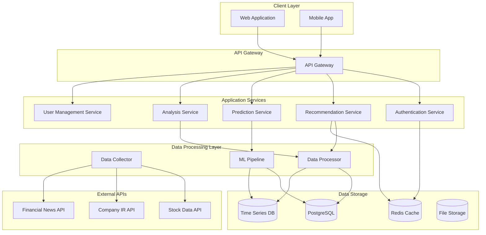

# Design Document

## Overview

The Intelligent Stock Recommendation System is a comprehensive platform that provides data-driven stock recommendations, future price projections, and evidence-based investment rationale for individual investors. The system differentiates itself from traditional market reports by offering actionable guidance including specific entry points, price appreciation forecasts, and optimal selling timing.

### Key Design Principles

1. **Data-Driven Decision Making**: All recommendations are based on proprietary algorithms analyzing multiple data sources
2. **Evidence-Based Rationale**: Every recommendation is supported by historical similar cases and company IR information
3. **Real-Time Validation**: Continuous tracking of predictions against actual market performance
4. **Personalization**: Tailored recommendations based on individual investor profiles and risk tolerance
5. **Scalability**: Designed to handle multiple users and large volumes of market data

## Architecture

### High-Level Architecture



### Technology Stack

- **Backend**: Python with FastAPI framework
- **Database**: PostgreSQL for relational data, InfluxDB for time series data
- **Cache**: Redis for session management and frequently accessed data
- **Machine Learning**: scikit-learn, TensorFlow for predictive modeling
- **Message Queue**: Celery with Redis for background tasks
- **Frontend**: React.js with TypeScript
- **Deployment**: Docker containers with Kubernetes orchestration

## Components and Interfaces

### 1. Data Collection Service

**Purpose**: Automatically collect and update stock prices, company IR information, and market data

**Key Components**:
- Stock Price Collector: Real-time and historical stock price data
- IR Information Collector: Company investor relations documents and announcements
- Market Data Collector: Market trends, sector performance, economic indicators
- News Collector: Financial news and market sentiment data

**Interfaces**:
```python
class DataCollectorInterface:
    def collect_stock_data(self, symbols: List[str]) -> StockDataResponse
    def collect_ir_data(self, company_id: str) -> IRDataResponse
    def collect_market_data(self, date_range: DateRange) -> MarketDataResponse
    def schedule_data_collection(self, frequency: str) -> None
```

### 2. Recommendation Engine

**Purpose**: Generate personalized stock recommendations using proprietary algorithms

**Key Components**:
- Algorithm Engine: Core recommendation logic
- Personalization Module: User preference integration
- Risk Assessment: Risk tolerance evaluation
- Entry Point Calculator: Optimal buy signal determination

**Interfaces**:
```python
class RecommendationEngineInterface:
    def generate_recommendations(self, user_profile: UserProfile) -> List[StockRecommendation]
    def calculate_entry_points(self, stock_symbol: str) -> EntryPointData
    def assess_risk_level(self, stock_symbol: str, user_profile: UserProfile) -> RiskLevel
    def personalize_recommendations(self, recommendations: List[StockRecommendation], user_profile: UserProfile) -> List[StockRecommendation]
```

### 3. Price Prediction Service

**Purpose**: Forecast future price movements with multiple scenario modeling

**Key Components**:
- Predictive Models: Machine learning models for price forecasting
- Scenario Generator: Best/worst/expected case modeling
- Timeline Calculator: Time-based milestone establishment
- Selling Point Optimizer: Optimal exit timing calculation

**Interfaces**:
```python
class PricePredictionInterface:
    def predict_price_trajectory(self, stock_symbol: str, time_horizon: int) -> PricePrediction
    def generate_scenarios(self, stock_symbol: str) -> ScenarioModeling
    def calculate_selling_points(self, stock_symbol: str, entry_price: float) -> SellingPoints
    def establish_milestones(self, prediction: PricePrediction) -> List[Milestone]
```

### 4. Analysis and Rationale Service

**Purpose**: Provide evidence-based investment rationale using IR data and historical cases

**Key Components**:
- IR Analyzer: Company investor relations information analysis
- Historical Pattern Matcher: Similar case identification
- Correlation Engine: Price movement and fundamental correlation
- Evidence Compiler: Rationale documentation generator

**Interfaces**:
```python
class AnalysisServiceInterface:
    def analyze_ir_data(self, company_id: str) -> IRAnalysis
    def find_similar_cases(self, stock_pattern: StockPattern) -> List[HistoricalCase]
    def correlate_fundamentals_price(self, stock_symbol: str) -> CorrelationAnalysis
    def compile_investment_rationale(self, stock_symbol: str) -> InvestmentRationale
```

### 5. Performance Tracking Service

**Purpose**: Monitor prediction accuracy and validate system effectiveness through real trading results

**Key Components**:
- Prediction Tracker: Continuous monitoring of predictions vs. actual prices
- Performance Calculator: Success rate and return calculation
- Validation Engine: Real trading result validation
- Reporting Generator: Performance report creation

**Interfaces**:
```python
class PerformanceTrackingInterface:
    def track_predictions(self, prediction_id: str) -> TrackingStatus
    def calculate_performance_metrics(self, time_period: DateRange) -> PerformanceMetrics
    def validate_trading_results(self, trade_data: TradeData) -> ValidationResult
    def generate_performance_report(self, user_id: str) -> PerformanceReport
```

## Data Models

### Core Data Models

```python
@dataclass
class StockRecommendation:
    symbol: str
    company_name: str
    entry_price: float
    target_price: float
    confidence_score: float
    risk_level: RiskLevel
    investment_rationale: str
    similar_cases: List[HistoricalCase]
    created_at: datetime

@dataclass
class PricePrediction:
    stock_symbol: str
    current_price: float
    predicted_prices: Dict[int, float]  # days -> price
    scenarios: ScenarioModeling
    milestones: List[Milestone]
    confidence_interval: Tuple[float, float]
    created_at: datetime

@dataclass
class UserProfile:
    user_id: str
    risk_tolerance: RiskLevel
    investment_period: int  # months
    investment_amount: float
    experience_level: ExperienceLevel
    preferences: Dict[str, Any]
    created_at: datetime
    updated_at: datetime

@dataclass
class HistoricalCase:
    case_id: str
    company_name: str
    symbol: str
    pattern_type: str
    price_appreciation: float
    time_period: int
    ir_factors: List[str]
    similarity_score: float

@dataclass
class InvestmentRationale:
    stock_symbol: str
    ir_analysis: IRAnalysis
    fundamental_factors: List[str]
    technical_factors: List[str]
    similar_cases: List[HistoricalCase]
    risk_factors: List[str]
    confidence_level: float
```

### Database Schema

```sql
-- Users table
CREATE TABLE users (
    id UUID PRIMARY KEY,
    email VARCHAR(255) UNIQUE NOT NULL,
    risk_tolerance VARCHAR(50),
    investment_period INTEGER,
    investment_amount DECIMAL(15,2),
    experience_level VARCHAR(50),
    preferences JSONB,
    created_at TIMESTAMP DEFAULT NOW(),
    updated_at TIMESTAMP DEFAULT NOW()
);

-- Stock recommendations table
CREATE TABLE stock_recommendations (
    id UUID PRIMARY KEY,
    user_id UUID REFERENCES users(id),
    symbol VARCHAR(10) NOT NULL,
    company_name VARCHAR(255),
    entry_price DECIMAL(10,2),
    target_price DECIMAL(10,2),
    confidence_score DECIMAL(3,2),
    risk_level VARCHAR(50),
    rationale TEXT,
    status VARCHAR(50),
    created_at TIMESTAMP DEFAULT NOW()
);

-- Price predictions table
CREATE TABLE price_predictions (
    id UUID PRIMARY KEY,
    stock_symbol VARCHAR(10) NOT NULL,
    current_price DECIMAL(10,2),
    predicted_prices JSONB,
    scenarios JSONB,
    confidence_interval JSONB,
    created_at TIMESTAMP DEFAULT NOW()
);

-- Historical cases table
CREATE TABLE historical_cases (
    id UUID PRIMARY KEY,
    symbol VARCHAR(10),
    company_name VARCHAR(255),
    pattern_type VARCHAR(100),
    price_appreciation DECIMAL(5,2),
    time_period INTEGER,
    ir_factors JSONB,
    case_data JSONB,
    created_at TIMESTAMP DEFAULT NOW()
);

-- Performance tracking table
CREATE TABLE performance_tracking (
    id UUID PRIMARY KEY,
    recommendation_id UUID REFERENCES stock_recommendations(id),
    prediction_id UUID REFERENCES price_predictions(id),
    actual_price DECIMAL(10,2),
    prediction_accuracy DECIMAL(5,2),
    tracking_date DATE,
    created_at TIMESTAMP DEFAULT NOW()
);
```

## Error Handling

### Error Categories

1. **Data Collection Errors**
   - API rate limiting
   - Data source unavailability
   - Data quality issues
   - Network connectivity problems

2. **Prediction Errors**
   - Model training failures
   - Insufficient historical data
   - Market volatility extremes
   - Algorithm convergence issues

3. **User Input Errors**
   - Invalid stock symbols
   - Unrealistic investment parameters
   - Incomplete user profiles
   - Authentication failures

### Error Handling Strategy

```python
class ErrorHandler:
    def handle_data_collection_error(self, error: DataCollectionError) -> ErrorResponse:
        if isinstance(error, RateLimitError):
            return self.schedule_retry_with_backoff(error)
        elif isinstance(error, DataQualityError):
            return self.flag_data_for_manual_review(error)
        else:
            return self.log_and_notify_admin(error)
    
    def handle_prediction_error(self, error: PredictionError) -> ErrorResponse:
        if isinstance(error, InsufficientDataError):
            return self.request_additional_data(error)
        elif isinstance(error, ModelError):
            return self.fallback_to_alternative_model(error)
        else:
            return self.provide_conservative_estimate(error)
    
    def handle_user_error(self, error: UserError) -> ErrorResponse:
        return ErrorResponse(
            message=error.user_friendly_message,
            suggestions=error.resolution_suggestions,
            error_code=error.code
        )
```

## Testing Strategy

### Unit Testing
- Test individual components in isolation
- Mock external dependencies (APIs, databases)
- Achieve 90%+ code coverage
- Focus on business logic and edge cases

### Integration Testing
- Test service-to-service communication
- Validate data flow between components
- Test database operations and transactions
- Verify external API integrations

### Performance Testing
- Load testing for concurrent users
- Stress testing for data processing pipelines
- Latency testing for real-time recommendations
- Scalability testing for growing data volumes

### Validation Testing
- Backtesting prediction accuracy against historical data
- A/B testing for recommendation algorithms
- Real trading simulation for system validation
- User acceptance testing for interface usability

### Testing Framework

```python
# Example test structure
class TestRecommendationEngine:
    def test_generate_recommendations_with_valid_profile(self):
        # Test normal recommendation generation
        pass
    
    def test_generate_recommendations_with_high_risk_tolerance(self):
        # Test risk-adjusted recommendations
        pass
    
    def test_generate_recommendations_with_insufficient_data(self):
        # Test error handling for data issues
        pass
    
    def test_personalization_accuracy(self):
        # Test recommendation personalization
        pass

class TestPricePrediction:
    def test_predict_price_trajectory_accuracy(self):
        # Backtest prediction accuracy
        pass
    
    def test_scenario_generation_completeness(self):
        # Test all scenarios are generated
        pass
    
    def test_selling_point_optimization(self):
        # Test optimal exit point calculation
        pass
```

### Continuous Integration/Continuous Deployment (CI/CD)

1. **Automated Testing Pipeline**
   - Run unit tests on every commit
   - Integration tests on pull requests
   - Performance tests on staging environment
   - Security scans and dependency checks

2. **Deployment Strategy**
   - Blue-green deployment for zero downtime
   - Feature flags for gradual rollouts
   - Automated rollback on failure detection
   - Database migration management

3. **Monitoring and Alerting**
   - Real-time system health monitoring
   - Prediction accuracy tracking
   - User experience metrics
   - Business KPI dashboards