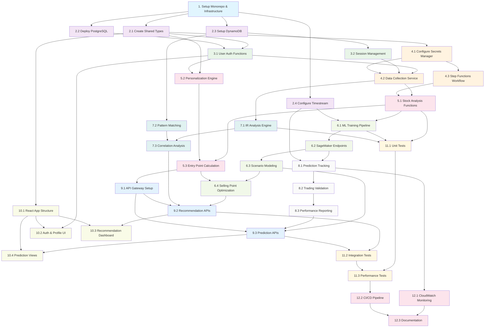

# Implementation Plan

## Task Dependency Graph

## Critical Path Analysis

### **Longest Critical Path** (Foundation → Core ML → Frontend)
1. **T1** → **T2.1** → **T5.1** → **T6.1** → **T6.2** → **T6.3** → **T9.3** → **T10.4** → **T11.2** → **T12.2**

**Estimated Duration**: 16-20 weeks

### **Parallel Development Streams**

#### **Stream 1: Data & Infrastructure** (Weeks 1-4)
- T1 → T2.1, T2.2, T2.3, T2.4 (can run in parallel)
- T4.1 (Secrets Manager setup)

#### **Stream 2: Authentication & Security** (Weeks 3-5)
- T3.1, T3.2 (depends on T2.1, T2.2, T2.3)
- Can start while data setup completes

#### **Stream 3: Core ML Pipeline** (Weeks 5-10)
- T5.1 → T6.1 → T6.2 → T6.3 → T6.4
- Critical path for ML functionality

#### **Stream 4: Analysis Engine** (Weeks 6-9)
- T7.1, T7.2 → T7.3 (can run parallel to ML pipeline)
- Depends on data collection (T4.2)

#### **Stream 5: API & Frontend** (Weeks 10-14)
- T9.1 → T9.2, T9.3 (depends on core services)
- T10.1 → T10.2, T10.3, T10.4 (can start early with mock data)

#### **Stream 6: Testing & Deployment** (Weeks 12-16)
- T11.1 → T11.2 → T11.3 (progressive testing)
- T12.1 → T12.2 → T12.3 (final deployment)

- [ ] 1. Set up TypeScript monorepo structure and core infrastructure
  - Create monorepo structure with shared libraries and types
  - Set up AWS CDK infrastructure as code with TypeScript
  - Configure development environment with linting, testing, and build tools
  - _Requirements: 6.1, 6.2_

- [ ] 2. Implement database schemas and data models
- [ ] 2.1 Create shared TypeScript interfaces and types
  - Define core data models (StockRecommendation, PricePrediction, UserProfile, etc.)
  - Create shared enums and utility types
  - Set up type validation with Zod or similar library
  - _Requirements: 1.1, 2.1, 3.1, 4.1, 5.1_

- [ ] 2.2 Deploy PostgreSQL database schema
  - Create RDS PostgreSQL instance with CDK
  - Implement database migration scripts for all tables
  - Set up database connection utilities and connection pooling
  - _Requirements: 6.1, 6.2_

- [ ] 2.3 Set up DynamoDB tables and indexes
  - Create DynamoDB tables with proper partition and sort keys
  - Configure Global Secondary Indexes for pattern matching and lookups
  - Implement TTL settings for session and cache data
  - _Requirements: 6.1, 6.2_

- [ ] 2.4 Configure Timestream database for time series data
  - Create Timestream database and tables for stock prices and metrics
  - Set up data retention policies and compression settings
  - Implement time series data ingestion utilities
  - _Requirements: 4.1, 4.2, 6.1_

- [ ] 3. Implement authentication and user management service
- [ ] 3.1 Create user authentication Lambda functions
  - Implement user registration, login, and JWT token management
  - Set up password hashing and validation
  - Create user profile CRUD operations
  - _Requirements: 5.1, 5.2, 5.5_

- [ ] 3.2 Implement user session management with DynamoDB
  - Create session storage and retrieval functions
  - Implement session expiration and cleanup
  - Add user preference management
  - _Requirements: 5.1, 5.3, 5.5_

- [ ] 4. Set up external API integration and secrets management
- [ ] 4.1 Configure AWS Secrets Manager for API credentials
  - Store external API keys (stock data providers, news APIs)
  - Implement credential rotation mechanisms
  - Create secure credential retrieval functions
  - _Requirements: 6.1, 6.3_

- [ ] 4.2 Implement data collection service with EventBridge
  - Create Lambda functions for stock price data collection
  - Set up EventBridge rules for scheduled data collection
  - Implement IR data collection from company sources
  - _Requirements: 1.1, 6.1, 6.4_

- [ ] 4.3 Create Step Functions workflow for data processing
  - Design data processing workflow with error handling
  - Implement data validation and quality checks
  - Set up retry mechanisms and dead letter queues
  - _Requirements: 6.3, 6.4_

- [ ] 5. Implement core recommendation engine
- [ ] 5.1 Create stock analysis Lambda functions
  - Implement fundamental analysis algorithms
  - Create technical analysis indicators
  - Build risk assessment calculations
  - _Requirements: 1.1, 1.2, 1.3_

- [ ] 5.2 Implement personalization engine
  - Create user preference matching algorithms
  - Implement risk tolerance assessment
  - Build recommendation filtering based on user profile
  - _Requirements: 1.2, 1.5, 5.2_

- [ ] 5.3 Create entry point calculation service
  - Implement optimal buy signal detection
  - Create entry price calculation algorithms
  - Add confidence scoring for recommendations
  - _Requirements: 1.3, 1.4_

- [ ] 6. Implement price prediction service with SageMaker
- [ ] 6.1 Create machine learning model training pipeline
  - Implement data preprocessing for ML models
  - Create model training scripts with historical data
  - Set up model versioning and artifact storage in S3
  - _Requirements: 2.1, 2.2, 6.2_

- [ ] 6.2 Deploy SageMaker endpoints for price prediction
  - Create SageMaker model endpoints for real-time inference
  - Implement model deployment automation
  - Set up A/B testing for different model versions
  - _Requirements: 2.1, 2.3_

- [ ] 6.3 Implement scenario modeling and milestone calculation
  - Create best/worst/expected case scenario generators
  - Implement time-based milestone establishment
  - Build confidence interval calculations
  - _Requirements: 2.2, 2.4_

- [ ] 6.4 Create selling point optimization service
  - Implement optimal exit timing algorithms
  - Create stop-loss and take-profit calculations
  - Add selling point recommendation logic
  - _Requirements: 2.5, 2.6_

- [ ] 7. Implement analysis and rationale service
- [ ] 7.1 Create IR data analysis engine
  - Implement company IR document parsing and analysis
  - Create sentiment analysis for IR announcements
  - Build impact scoring for IR events
  - _Requirements: 3.1, 3.2_

- [ ] 7.2 Implement historical pattern matching
  - Create pattern recognition algorithms for similar cases
  - Implement similarity scoring mechanisms
  - Build historical case retrieval from DynamoDB
  - _Requirements: 3.3, 3.4_

- [ ] 7.3 Create correlation analysis service
  - Implement price movement and fundamental correlation
  - Create factor analysis for investment rationale
  - Build evidence compilation for recommendations
  - _Requirements: 3.2, 3.4_

- [ ] 8. Implement performance tracking and validation
- [ ] 8.1 Create prediction accuracy tracking system
  - Implement continuous monitoring of predictions vs actual prices
  - Create accuracy calculation algorithms
  - Set up automated tracking data ingestion to Timestream
  - _Requirements: 4.1, 4.2_

- [ ] 8.2 Implement trading result validation
  - Create real trading result capture mechanisms
  - Implement capital gains calculation
  - Build performance metrics calculation
  - _Requirements: 4.3, 4.4_

- [ ] 8.3 Create performance reporting service
  - Implement user performance report generation
  - Create system-wide success rate calculations
  - Build performance dashboard data APIs
  - _Requirements: 4.2, 4.4_

- [ ] 9. Implement API Gateway and Lambda functions
- [ ] 9.1 Create REST API endpoints with API Gateway
  - Set up API Gateway with Lambda proxy integration
  - Implement authentication middleware
  - Create rate limiting and throttling
  - _Requirements: 1.1, 2.1, 3.1, 4.1, 5.1_

- [ ] 9.2 Implement recommendation API endpoints
  - Create GET /recommendations endpoint for user recommendations
  - Implement POST /recommendations/feedback for user feedback
  - Add GET /recommendations/{id}/details for detailed rationale
  - _Requirements: 1.1, 1.4, 3.1, 3.4_

- [ ] 9.3 Create prediction and analysis API endpoints
  - Implement GET /predictions/{symbol} for price predictions
  - Create GET /analysis/{symbol} for investment rationale
  - Add GET /performance/{userId} for user performance data
  - _Requirements: 2.1, 2.4, 3.1, 4.2_

- [ ] 10. Implement frontend React application
- [ ] 10.1 Create React TypeScript application structure
  - Set up React app with TypeScript and shared types
  - Implement routing and navigation
  - Create reusable UI components and design system
  - _Requirements: 1.1, 2.1, 3.1, 4.1, 5.1_

- [ ] 10.2 Implement user authentication and profile management
  - Create login/register forms with validation
  - Implement user profile management interface
  - Add investment preference configuration
  - _Requirements: 5.1, 5.2, 5.5_

- [ ] 10.3 Create stock recommendation dashboard
  - Implement recommendation list with filtering and sorting
  - Create detailed recommendation view with rationale
  - Add investment tracking and portfolio overview
  - _Requirements: 1.1, 1.4, 3.1, 3.4_

- [ ] 10.4 Implement price prediction and analysis views
  - Create price prediction charts and scenario visualization
  - Implement historical case comparison interface
  - Add performance tracking dashboard
  - _Requirements: 2.1, 2.2, 3.3, 4.2_

- [ ] 11. Implement comprehensive testing suite
- [ ] 11.1 Create unit tests for all Lambda functions
  - Write unit tests for recommendation engine logic
  - Test price prediction algorithms with mock data
  - Create tests for data processing and validation
  - _Requirements: 1.1, 2.1, 3.1, 6.1_

- [ ] 11.2 Implement integration tests for API endpoints
  - Test API Gateway integration with Lambda functions
  - Create end-to-end tests for recommendation flow
  - Test database operations and data consistency
  - _Requirements: 1.1, 2.1, 3.1, 4.1_

- [ ] 11.3 Create performance and load testing
  - Implement load testing for concurrent users
  - Test Lambda cold start performance
  - Create stress tests for data processing pipelines
  - _Requirements: 6.1, 6.2_

- [ ] 12. Set up monitoring, alerting, and deployment
- [ ] 12.1 Configure CloudWatch monitoring and alarms
  - Set up Lambda function monitoring and error alerting
  - Create business metrics dashboards
  - Implement cost monitoring and budget alerts
  - _Requirements: 4.1, 4.2, 6.1_

- [ ] 12.2 Implement CI/CD pipeline with GitHub Actions
  - Create automated testing and deployment pipeline
  - Set up staging and production environments
  - Implement blue-green deployment for Lambda functions
  - _Requirements: 6.1, 6.2_

- [ ] 12.3 Create system documentation and operational runbooks
  - Document API endpoints and data models
  - Create troubleshooting guides and operational procedures
  - Implement system health checks and monitoring
  - _Requirements: 6.1, 6.2_